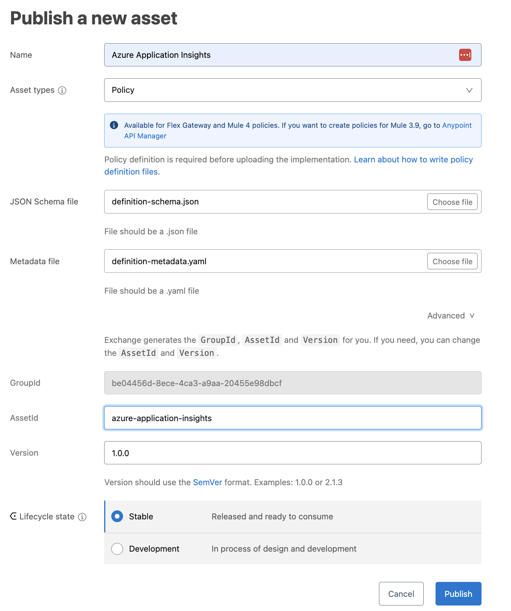
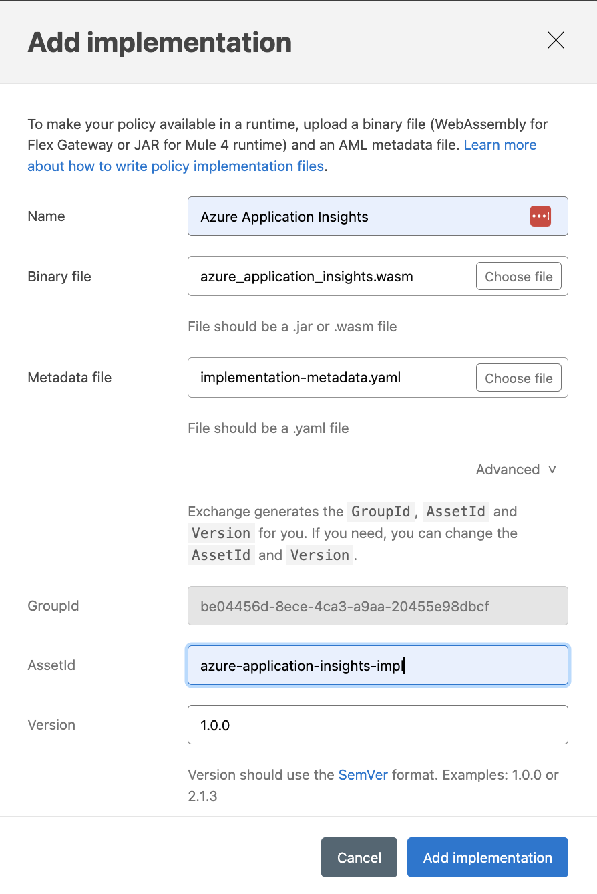

# Azure Application Insights Flex Gateway Policy
A Policy PoC to instrument Azure Application Insights on Flex Gateway APIs.


## Build
```make build```

The binary file will be in `target/wasm32-unknown-unknown/release/azure_application_insights.wasm`

## Deploy to Exchange
1. Set the policy definitions:

    

2. Add the policy implementation:

    

## Use in API Manager
1. Add the policy to the API
2. Configurable properties
    * Azure Region
    * API Key
    * Instrumentation Key
    * Request-ID header name
    * Correlation-ID header name

